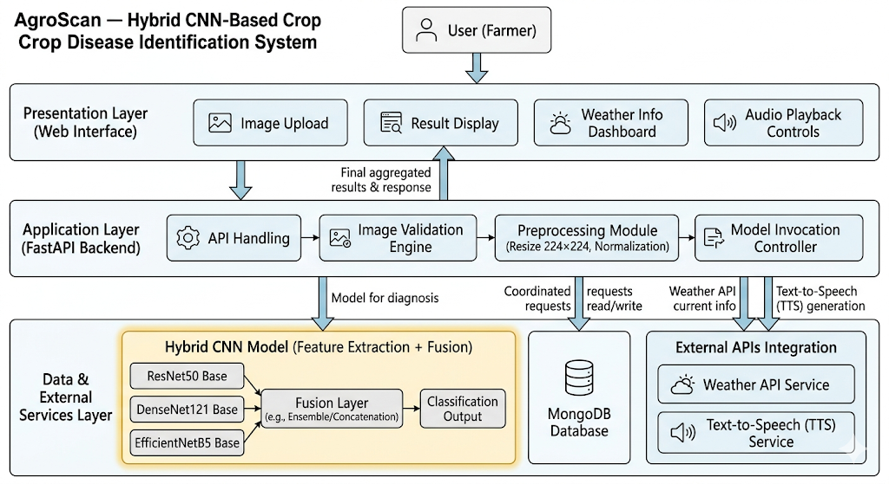
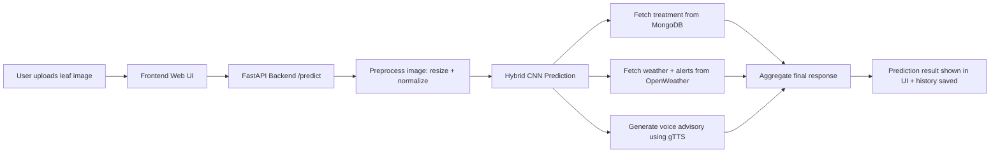
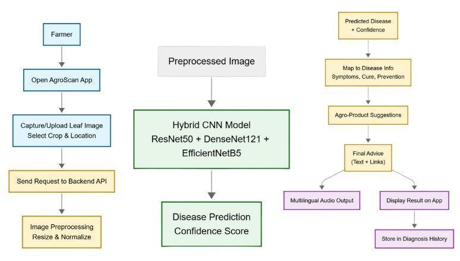
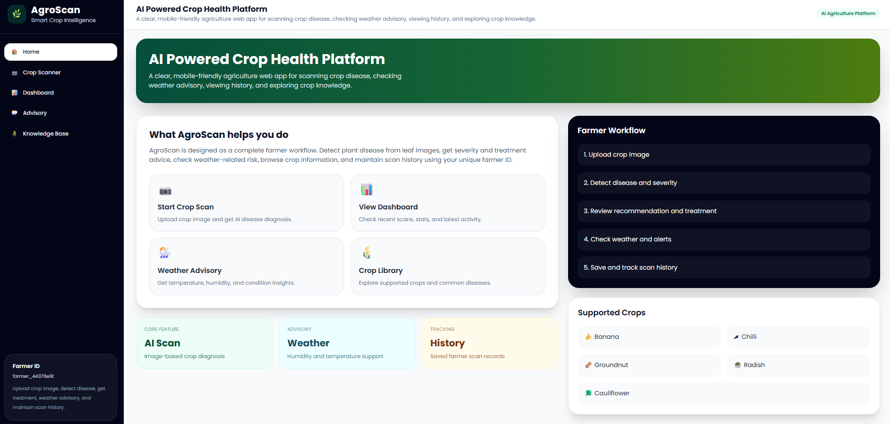
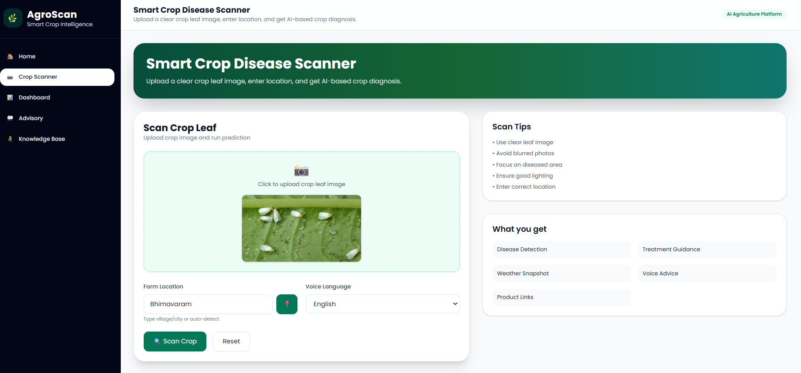
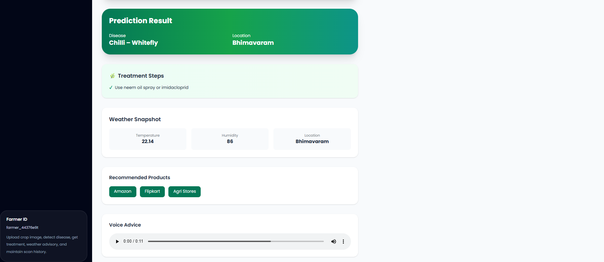
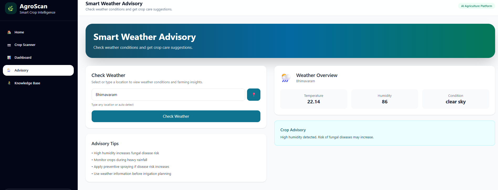
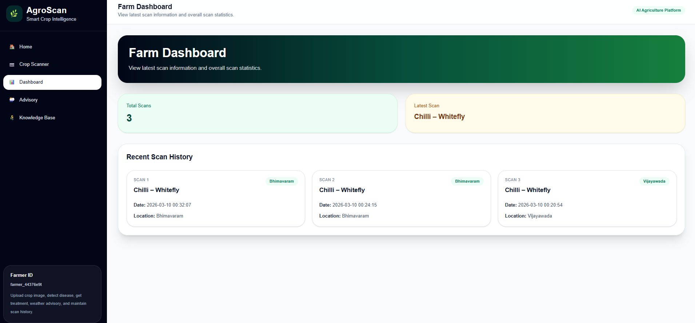

# AgroScan – AI Crop Disease Detection and Advisory System

Designed and developed an end-to-end AI crop disease detection system for multi-crop leaf analysis, treatment support, weather-aware alerts, and voice advisory.
Built and integrated the frontend, FastAPI backend, hybrid CNN inference pipeline, external APIs, and MongoDB-backed history tracking into one deployable workflow.

## Problem Statement

Farmers often rely on manual disease identification, which is slow and error-prone in real field conditions. Delayed diagnosis leads to yield loss, incorrect pesticide usage, and poor crop management decisions. AgroScan addresses this by providing instant AI-based disease detection with actionable treatment and weather context.

## Key Features

- Leaf image disease prediction using a hybrid CNN (ResNet50 + DenseNet121 + EfficientNetB5 fusion)
- Multi-crop support (Banana, Chilli, Groundnut, Radish, Cauliflower)
- Treatment recommendation with practical intervention steps
- Weather advisory and disease-risk context via OpenWeatherMap
- Multilingual voice advisory (Telugu, Hindi, English) using TTS
- Prediction history and dashboard analytics using MongoDB
- Clean web UI for home, scan, results, advisory, dashboard, and disease library

## System Architecture





## Tech Stack

- Frontend: HTML, CSS, JavaScript
- Backend: FastAPI, Uvicorn, Python
- ML/DL: TensorFlow/Keras, OpenCV, NumPy
- Database: MongoDB (PyMongo)
- External APIs/Services: OpenWeatherMap API, gTTS
- Utilities: geopy, python-dotenv

## Dataset Used

- Dataset: **Mendeley Multi-Crop Plant Disease Dataset**
- Source: https://data.mendeley.com/datasets/6243z8r6t6/1
- Crops covered: Banana, Chilli, Groundnut, Radish, Cauliflower
- Class coverage: **23 total classes** (22 disease classes + 1 healthy class)
- Disease groups include examples such as Sigatoka variants, Anthracnose, Leaf Curl, Rust, Mosaic Virus, Downy Mildew, Black Rot, and Bacterial Spot.

Crop-wise class distribution (from project documentation):

- Banana: 8 disease classes
- Chilli: 4 disease classes
- Groundnut: 4 disease classes
- Radish: 3 disease classes
- Cauliflower: 3 disease classes
- Plus healthy class: 1

## Model Details

- Model type: **Hybrid CNN using transfer learning + feature fusion**
- Backbones: ResNet50, DenseNet121, EfficientNetB5 (`include_top=False`, ImageNet weights)
- Input size: `224 x 224` leaf image
- Preprocessing:
- Resize to `224x224`
- Color conversion `BGR -> RGB`
- Architecture-specific normalization (ResNet50 mean-centering, DenseNet121 [0,1], EfficientNetB5 [-1,1])
- Augmentation used:
- Random horizontal/vertical flip
- Rotation (+/-30 degrees)
- Width/height shift (+/-20%)
- Zoom (+/-20%)
- Shear (+/-15%)
- Brightness adjustment (+/-20%)
- Feature fusion:
- ResNet50 GAP output: 2048-dim
- DenseNet121 GAP output: 1024-dim
- EfficientNetB5 GAP output: 2048-dim
- Concatenated feature vector: **5120-dim**
- Classification head:
- Dense(512, ReLU) + Dropout(0.5)
- Dense(256, ReLU) + Dropout(0.4)
- Dense(23, Softmax)
- Output format: top predicted disease class + confidence, with treatment/weather/voice payload in API response

## Workflow



1. Upload leaf image in the Crop Scanner page.
2. FastAPI receives and validates image/location/language inputs.
3. Backend preprocesses image and runs Hybrid CNN prediction.
4. System predicts disease class with confidence score.
5. Backend fetches treatment guidance and product links.
6. Backend fetches weather insights and generates advisory alerts.
7. TTS engine generates multilingual voice advisory.
8. Results are shown on UI and saved into prediction history.

## Results

### Model Performance

- Training Accuracy: **97.35%**
- Validation Accuracy: **94.89%**
- Test Accuracy: **94.89%**
- Training Loss: **0.0947**
- Validation Loss: **0.2076**
- Final Test Loss: **0.1818**
- Weighted F1-Score: **0.94**

### Sample Prediction

- Example from system testing: `Chilli – Whitefly` with treatment suggestion, weather snapshot, and voice advisory in one output flow.

### Limitations (Real-World)

- Model may confuse visually similar diseases across related classes.
- Performance can drop on low-light, blurred, or noisy field images.
- Internet is currently required for weather and cloud database access.
- Real-field robustness still benefits from larger and more diverse on-farm data.

### Demo Proof

- GitHub Repository: https://github.com/MokshithaDara/AgroScan
- YouTube Demo: https://youtu.be/EVTmfIjDqBU
- Model Colab (training/reference): https://colab.research.google.com/drive/1sdNVRdto2msJwrKHiZvyfze1mRRfAMmf?usp=sharing

## Screenshots

### Home Screen



### Scan/Upload Page



### Prediction Result



### Treatment Recommendation (Treatment + Weather + Voice)



### Dashboard/History Page



## Installation Steps

### 1) Clone and Backend Setup

```bash
git clone https://github.com/MokshithaDara/AgroScan.git
cd AgroScan
cd backend
python -m venv venv
# Windows PowerShell
.\venv\Scripts\Activate.ps1
pip install -r requirements.txt
```

### 2) Environment Configuration (`.env`)

Create `backend/.env` (or copy from `backend/.env.example`) and set:

```env
OPENWEATHER_API_KEY=your_key
MONGO_URL=your_mongodb_url
MONGO_DB_NAME=agroscan_db
CORS_ORIGINS=http://127.0.0.1:5500,http://localhost:5500
```

### 3) Run Backend

```bash
cd backend
python main.py
```

### 4) Run Frontend

```bash
cd frontend
python -m http.server 5500
```

Open:

- Frontend: `http://127.0.0.1:5500/index.html`
- Backend API: `http://127.0.0.1:8000`
- Swagger Docs: `http://127.0.0.1:8000/docs`

### 5) Clean Project Structure

```text
AgroScan/
  frontend/
  backend/
  model/
  assets/
  screenshots/
  README.md
  .gitignore
  requirements.txt
```

## Future Scope

- Top-3 predictions with uncertainty estimation for safer advisory.
- Grad-CAM explainability to visualize disease regions.
- Offline/edge inference for low-connectivity farm areas.
- Multilingual voice expansion with richer local dialect support.
- Farmer chatbot for symptom Q&A and follow-up guidance.
- Disease severity estimation and stage-wise treatment planning.
- Fertilizer/pesticide dosage optimization by crop growth stage.
- Live production deployment with geo-tagged outbreak monitoring.

---

